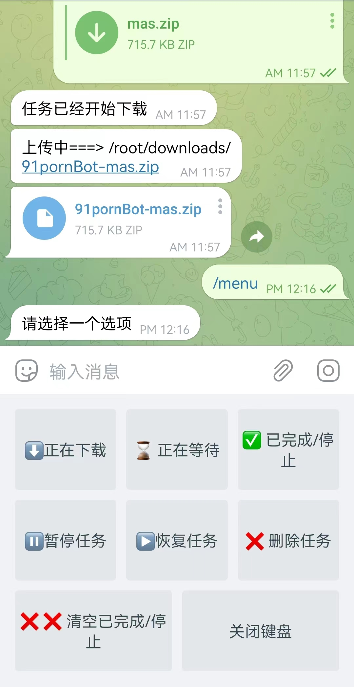

# ariabot

aria2 telegram bot

### 特点

1. 基于电报机器人控制aria2，自行设置下载完成后是否上传telegram
2. ~~多用户，每个用户只能看到自己的任务~~，单用户现在，多用户没什么用
3. 支持 http、磁力、种子下载


### 缺点

1. 由于电报单个文件2G限制,超过2g文件将上传失败

### 如何安装

1.编辑docker-compose.yml

```yaml
      API_ID: 121233 # https://my.telegram.org 获取
      API_HASH: fafddddddd # https://my.telegram.org 获取
      BOT_TOKEN: 19092ddd4224:AAE5bX4RkyJmvpCEgnbc5IPLrxMCtwODSYk # 在telegram @BotFather 获取
      JSON_RPC_URL: http://11111:6800/jsonrpc
      JSON_RPC_TOKEN: 11111
      SEND_ID: 11111     #可以启动bot后 /start 获取，或者转发消息给 @get_id_bot 
      #      PROXY_IP:   #可选  代理ip
      #      PROXY_PORT:  #可选 代理端口
      UP_TELEGRAM: 'False' #是否上传电报
```

2.启动


安装 docker

```
curl -fsSL get.docker.com -o get-docker.sh&&sh get-docker.sh &&systemctl enable docker&&systemctl start docker
```


更新镜像

```
docker compose pull
```

删除容器（如果容器存在）
```
docker rm -f arbot
```

后台启动
```yaml
docker compose up -d
```

查看日志

```yaml
docker logs -f arbot
```

### 可选安装

aria2 一键安装脚本

```yaml
https://github.com/P3TERX/aria2.sh
```

### 应用截图



### 灵感来自

https://github.com/HouCoder/tele-aria2

https://github.com/synodriver/aioaria2

多平台构建参考: https://cloud.tencent.com/developer/article/1543689

